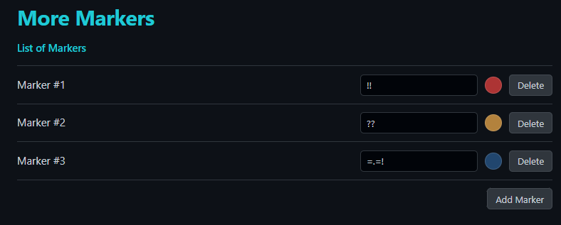
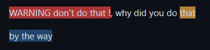

# More Markers

Actually, you can only use \=\=word\=\= to highlight a word in Obsidian.

This plugin allows you create your own markers to highlight text in your files.

## Personalization

You can create marker with several symbols to highlight text with the color backgroud that you want.

<u>example with the settings above</u> :

## TO DO

-   [ ] In editor : show color instead of doing nothing
-   [ ] In editor: allow user to select word and write symbols without deleting the word
-   [ ] In context menu: add a button to add a marker to the selected text
-   [ ] In settings: add delay before refreshing preview when user update settings
-   [ ] In settings: add a color picker to choose text color
-   [ ] In settings: add a select to choose text style (bold, italic, underline, strikethrough)
